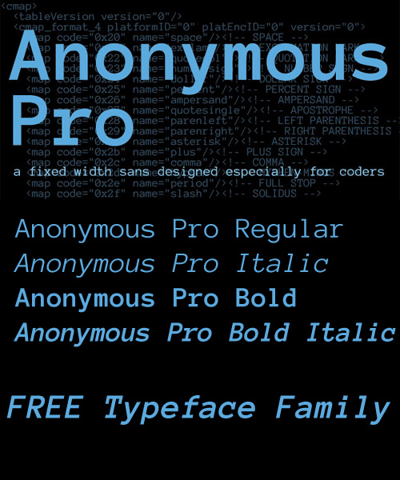
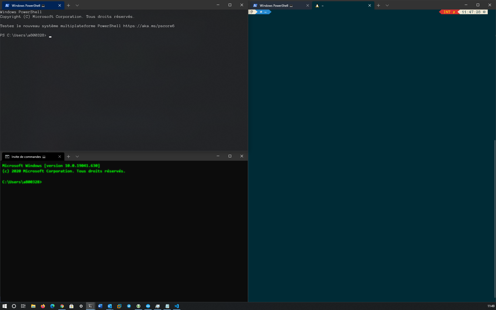

# Pimp my Shell !

- [Pimp my Shell !](#pimp-my-shell--)
  * [VIM](#vim)
    + [Install](#install)
    + [Mappings](#mappings)
    + [Credits](#credits)
  * [TMUX](#tmux)
    + [My Mappings](#my-mappings)
    + [Use Tmux](#use-tmux)
    + [List all shortcuts](#list-all-shortcuts)
    + [Sessions](#sessions)
    + [Save / Restore Tmux-session](#save---restore-tmux-session)
  * [ZSH](#zsh)
    + [How to install](#how-to-install)
    + [Install Oh-my-ZSH](#install-oh-my-zsh)
    + [Install powerline10k](#install-powerline10k)
    + [Install plugins :](#install-plugins--)
      - [fzf](#fzf)
      - [colorls](#colorls)
      - [zsh-autosuggestions](#zsh-autosuggestions)
      - [zsh-syntax-highlighting](#zsh-syntax-highlighting)
      - [update-custom-plugins](#update-custom-plugins)
      - [.zshrc](#zshrc)
  * [Windows Terminal](#windows-terminal)
    + [Font](#font)
    + [My Windows Terminal Settings](#my-windows-terminal-settings)
      - [My shortcuts](#my-shortcuts)
      - [My Settings](#my-settings)

## VIM

Custom vim configuration, highly inspired from [VIM and Python – A Match Made in Heaven](https://realpython.com/vim-and-python-a-match-made-in-heaven/)


### Install
#### Requirements

Before running `setupVim.sh` make sure your system meets all the requirements below :

- vim (yeah, really)
- git
- build-essential
- cmake
- python
- python-pip

You can install them with

```bash
sudo apt-get update
sudo apt-get install -y vim git build-essential cmake python python-pip
```

or for CentOS/Fedora/RedHAt

```bash
sudo dnf udpate
sudo dnf install -y vim git cmake gcc-c++ make python3-devel
sudo dnf groupinstall 'Development Tools'
```

end run `bash setupVim.sh`

#### Note
This script was tested on Ubuntu > 16.04 & Fedora > 30

### Mappings

| Controls | Mode | Description |
| -------- | ---- | ----------- |
| `Ctrl` + `hjkl` | `Normal` | Switch panes |
| `Ctrl` + `hjkl` | `Insert` | Move |
| `Ctrl` + `Space` | `Normal` | Toggle NERDTree |
| `F2` | - | Paste toggle |
| `F3` | - | Display number line toggle |
| `F4` | - | Ask password for save as root |

### Credits

1. [VIM and Python – A Match Made in Heaven](https://realpython.com/vim-and-python-a-match-made-in-heaven/)  
2. [Vundle - Vim Plugin Manager](https://github.com/gmarik/Vundle.vim)  
3. [YouCompleteMe - Vim Plugin](https://github.com/Valloric/YouCompleteMe)  
4. [Syntastic - Vim Plugin](https://github.com/vim-syntastic/syntastic)  
5. [Vim-Flake8 - Vim Plugin](https://github.com/nvie/vim-flake8)  
6. [NERDTree - Vim Plugin](https://github.com/scrooloose/nerdtree)  
7. [NERDTreeTabs - Vim Plugin](https://github.com/jistr/vim-nerdtree-tabs)  
8. [Powerline - Vim Plugin](https://github.com/powerline/powerline)  
9. [Rupza - Vim Color Scheme](https://github.com/felipesousa/rupza)  


## TMUX

My Tmux configuration


Copy file `.tmux.conf` to `~/.tmux.conf`

### My Mappings

| Controls | Description |
| -------- | ----------- |
| `Ctrl` + `q` | Enter Tmux |
| `-` | Split a window horizontally |
| `+` | Split a window vertically |
| `Ctrl + arrow` | Switch betewen panes |
| `Shift + arrow` | Key to move between windows |
| `e` | Edit and source the .tmux.conf file |
| `R` | Source the .tmux.conf file |

### Use Tmux

start new:

    tmux

start new with session name:

    tmux new -s myname

attach:

    tmux a  #  (or at, or attach)

attach to named:

    tmux a -t myname

list sessions:

    tmux ls

<a name="killSessions"></a>kill session:

    tmux kill-session -t myname

<a name="killAllSessions"></a>Kill all the tmux sessions:

    tmux ls | grep : | cut -d. -f1 | awk '{print substr($1, 0, length($1)-1)}' | xargs kill

In tmux, hit the prefix `ctrl+b` (my modified prefix is ctrl+a) and then:

### List all shortcuts
to see all the shortcuts keys in tmux simply use the `bind-key ?` in my case that would be `CTRL-B ?`

### Sessions

    :new<CR>  new session
    s  list sessions
    $  name session

### <a name="WindowsTabs"></a>Windows (tabs)

    c  create window
    w  list windows
    n  next window
    p  previous window
    f  find window
    ,  name window
    &  kill window

### <a name="PanesSplits"></a>Panes (splits) 

    +  vertical split
    -  horizontal split
    
    o  swap panes
    q  show pane numbers
    x  kill pane
    ⍽  space - toggle between layouts
    <prefix> q (Show pane numbers, when the numbers show up type the key to goto that pane)
    <prefix> { (Move the current pane left)
    <prefix> } (Move the current pane right)
    <prefix> z toggle pane zoom

### Save / Restore Tmux-session

I find a little script to save/restore tmux session. [source here](https://github.com/mislav/dotfiles/blob/d2af5900fce38238d1202aa43e7332b20add6205/bin/tmux-session)

Put script in : `sudo vim /usr/local/bin/tmux-session`, add `sudo chmod +x /usr/local/bin/tmux-session`. 

Call it like so manually or periodically from cron (because you might forget):

```bash
tmux-session save
```

It will write to `~/.tmux-session`. Restore them after reboot like so:

```bash
tmux-session restore
```

## ZSH

My custom ZSH


### How to install

1. First install Oh-my-ZSH and Powerline10k. 
2. Next install plugins 
3. Replace default `~/.zshrc` by my `.zshrc`

```
mv ~/.zshrc .zshrc."$(date +%F)"
cp .zshrc ~/.zshrc
```

### Install Oh-my-ZSH

Oh My Zsh is an open source, community-driven framework for managing your Zsh configuration.

```bash
sh -c "$(curl -fsSL https://raw.github.com/ohmyzsh/ohmyzsh/master/tools/install.sh)"
```

### Install powerline10k

Powerlevel10k is a theme for Zsh. It emphasizes speed, flexibility and out-of-the-box experience.

[](https://asciinema.org/a/259663)

```bash
git clone --depth=1 https://github.com/romkatv/powerlevel10k.git ${ZSH_CUSTOM:-$HOME/.oh-my-zsh/custom}/themes/powerlevel10k

```

### Install plugins : 

#### fzf

```bash
git clone --depth 1 https://github.com/junegunn/fzf.git ~/.fzf
~/.fzf/install
```

#### colorls

https://github.com/athityakumar/colorls#installation

#### zsh-autosuggestions

```bash
git clone https://github.com/zsh-users/zsh-autosuggestions ${ZSH_CUSTOM:-~/.oh-my-zsh/custom}/plugins/zsh-autosuggestions
```

#### zsh-syntax-highlighting

```bash
git clone https://github.com/zsh-users/zsh-syntax-highlighting.git ${ZSH_CUSTOM:-~/.oh-my-zsh/custom}/plugins/zsh-syntax-highlighting
```

#### update-custom-plugins

```bash
git clone https://github.com/tautomer/update-ohmyzsh-custom-plugins.git $ZSH_CUSTOM/plugins/update-custom-plugins
```

#### .zshrc

In my .zshrc, I use this plugins

- git
- zsh-autosuggestions
- tmux
- zsh-syntax-highlighting
- fzf
- dnf
- ansible
- docker
- docker-compose
- command-not-found
- emoji-clock
- nmap
- sudo
- zsh_reload
- auto-color-ls
- colorize
- colored-man-pages
- terraform
- update-custom-plugins

## Windows Terminal

Windows Terminal is a multi-tabbed command-line front-end that Microsoft has developed for Windows 10.It can run any command-line app, including all Windows terminal emulators, in a separate tab. It is preconfigured to run Command Prompt, PowerShell, WSL, SSH, and Azure Cloud Shell Connector.

### Font

I love Anonymous Pro Font. [Download](https://github.com/ryanoasis/nerd-fonts/releases/download/v2.1.0/AnonymousPro.zip)



For others fonts check here : [https://www.nerdfonts.com/](https://www.nerdfonts.com/)

### My Windows Terminal Settings



In Windows Terminal, Open settings (Ctrl+,) and paste my settings.json. 

#### My shortcuts

| Keybinding | Description |
| --- | --- |
| Ctrl+Shift+f | Open Search Box |
| Ctrl+Shift+P | Open Command Palette (Default) |
| Alt+Shift+d | Auto Split Pane in duplicate mode |
| Alt+Shift+- | Horizontal Split Pane in duplicate mode |
| Alt+Shift+plus | Vertical Split Pane in duplicate mode |
| Alt+Shift+numpad_minux | Horizontal Split Pane in duplicate mode |
| Alt+Shift+numpad_plus | Vertical Split Pane in duplicate mode |

#### My Settings 

```json
// selections are automatically copied to your clipboard.
"copyOnSelect": true,

// formatted data is also copied to your clipboard
"copyFormatting": false,
```


