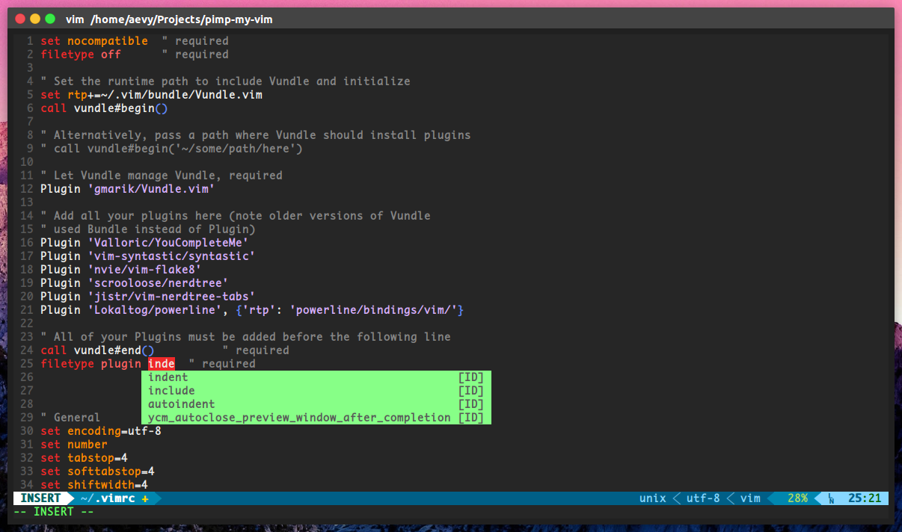
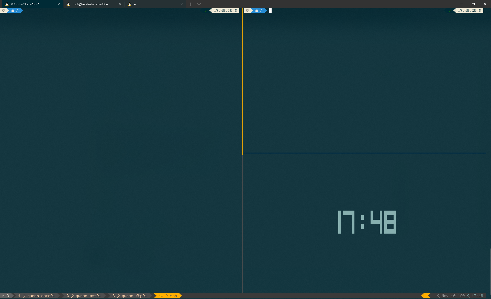
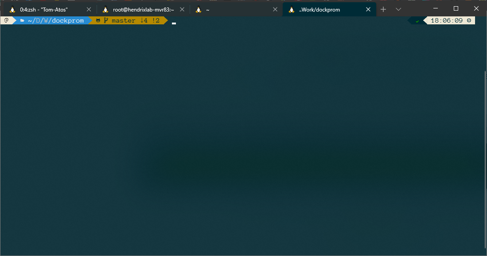

# Pimp my Shell !

## VIM

Custom vim configuration, highly inspired from [VIM and Python – A Match Made in Heaven](https://realpython.com/vim-and-python-a-match-made-in-heaven/)



### Install
#### Requirements

Before running `setupVim.sh` make sure your system meets all the requirements below :

- vim (yeah, really)
- git
- build-essential
- cmake
- python
- python-pip

You can install them with `
```
sudo apt-get update
sudo apt-get install -y vim git build-essential cmake python python-pip
```
or for CentOS/Fedora/RedHAt
```
sudo dnf udpate
sudo dnf install -y vim git cmake gcc-c++ make python3-devel
sudo dnf groupinstall 'Development Tools'
```

end run `bash setupVim.sh`

#### Note
This script was tested on Ubuntu > 16.04 & Fedora > 30

### Mappings

| Controls | Mode | Description |
| -------- | ---- | ----------- |
| `Ctrl` + `hjkl` | `Normal` | Switch panes |
| `Ctrl` + `hjkl` | `Insert` | Move |
| `Ctrl` + `Space` | `Normal` | Toggle NERDTree |
| `F2` | - | Paste toggle |
| `F3` | - | Display number line toggle |
| `F4` | - | Ask password for save as root |


### Credits
1. [VIM and Python – A Match Made in Heaven](https://realpython.com/vim-and-python-a-match-made-in-heaven/)  
2. [Vundle - Vim Plugin Manager](https://github.com/gmarik/Vundle.vim)  
3. [YouCompleteMe - Vim Plugin](https://github.com/Valloric/YouCompleteMe)  
4. [Syntastic - Vim Plugin](https://github.com/vim-syntastic/syntastic)  
5. [Vim-Flake8 - Vim Plugin](https://github.com/nvie/vim-flake8)  
6. [NERDTree - Vim Plugin](https://github.com/scrooloose/nerdtree)  
7. [NERDTreeTabs - Vim Plugin](https://github.com/jistr/vim-nerdtree-tabs)  
8. [Powerline - Vim Plugin](https://github.com/powerline/powerline)  
9. [Rupza - Vim Color Scheme](https://github.com/felipesousa/rupza)  


## TMUX

My Tmux configuration



Copy file `.tmux.conf` to `~/.tmux.conf`

### Mappings

| Controls | Description |
| -------- | ----------- |
| `Ctrl` + `q` | Enter Tmux |
| `-` | Split a window horizontally |
| `\|` | Split a window vertically |
| `Ctrl + arrow` | Switch betewen panes |
| `Shift + arrow` | Key to move between windows |
| `e` | Edit and source the .tmux.conf file |
| `R` | Source the .tmux.conf file |

## ZSH

My custom ZSH



### How to install

First install Oh-my-ZSH and Powerline10k. 

Next install plugins and replace default `zshrc` by my `.zshrc`

```
mv ~/.zshrc .zshrc."$(date +%F)"
cp .zshrc ~/.zshrc
```

### Install Oh-my-ZSH

```bash
sh -c "$(curl -fsSL https://raw.github.com/ohmyzsh/ohmyzsh/master/tools/install.sh)"
```

### Install powerline10k

```bash
git clone --depth=1 https://github.com/romkatv/powerlevel10k.git ${ZSH_CUSTOM:-$HOME/.oh-my-zsh/custom}/themes/powerlevel10k

```

### Install plugins : 

#### fzf

```bash
git clone --depth 1 https://github.com/junegunn/fzf.git ~/.fzf
~/.fzf/install
```

#### colorls

https://github.com/athityakumar/colorls#installation

#### zsh-autosuggestions

```bash
git clone https://github.com/zsh-users/zsh-autosuggestions ${ZSH_CUSTOM:-~/.oh-my-zsh/custom}/plugins/zsh-autosuggestions
```

#### zsh-syntax-highlighting

```bash
git clone https://github.com/zsh-users/zsh-syntax-highlighting.git ${ZSH_CUSTOM:-~/.oh-my-zsh/custom}/plugins/zsh-syntax-highlighting
```

#### update-custom-plugins

```bash
git clone https://github.com/tautomer/update-ohmyzsh-custom-plugins.git $ZSH_CUSTOM/plugins/update-custom-plugins
```

#### .zshrc

In my .zshrc, I use this plugins

- git
- zsh-autosuggestions
- tmux
- zsh-syntax-highlighting
- fzf
- dnf
- ansible
- docker
- docker-compose
- command-not-found
- emoji-clock
- nmap
- sudo
- zsh_reload
- auto-color-ls
- colorize
- colored-man-pages
- terraform
- update-custom-plugins

